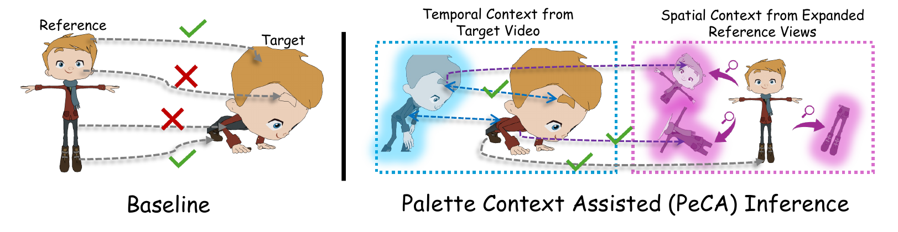

# PeCA Project Page

Static project page for:

**PeCA: Palette Context Assisted Inference for Test-Time Paint-Bucket Colourisation on Animation Videos**  
Dongheng Lin and Jianbo Jiao, ECCV 2026.

[🌐 **Project Page**](https://rathgrith.github.io/PeCA/) ·
[📄 **Paper**](https://rathgrith.github.io/assets/peca_eccv2026.pdf) ·
[💻 **Code**](https://github.com/Rathgrith/PeCA/tree/main/code) ·
[🗂️ **Dataset**](https://www.kaggle.com/datasets/f4d74236ea8f91768f5c81236f84e86080cf26a4de0c0833ac760c354d0dc365) ·

Code release included under `code/`.
