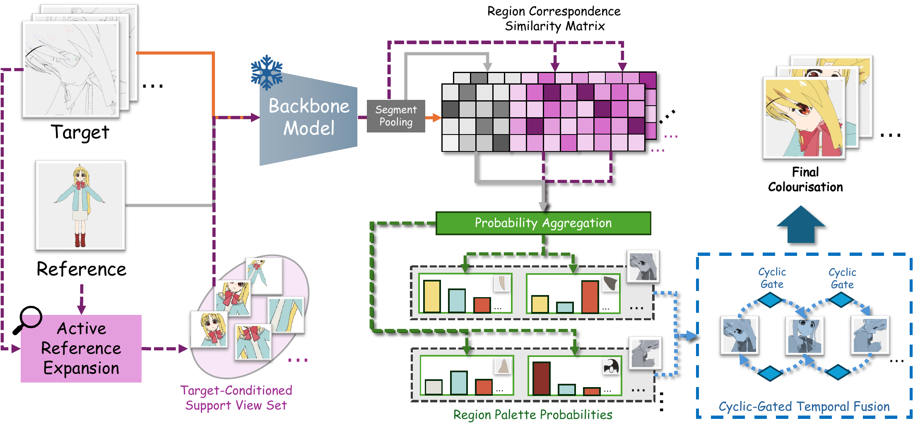

# PeCA

Official ECCV 2026 code release for **PeCA: Palette Context Assisted Inference for Test-Time Paint-Bucket Colourisation on Animation Videos**.

[🌐 **Project Page**](https://rathgrith.github.io/PeCA/) ·
[📄 **Paper**](https://rathgrith.github.io/assets/peca_eccv2026.pdf) ·
[💻 **Code**](https://github.com/Rathgrith/PeCA/tree/main/code) ·
[🗂️ **Anita-Pirate Dataset**](https://www.kaggle.com/datasets/f4d74236ea8f91768f5c81236f84e86080cf26a4de0c0833ac760c354d0dc365) ·


[](https://rathgrith.github.io/PeCA/)

Please refer to ```./code/README.md``` for code implementation and detailed usage documents.

## Citation

```bibtex
@inproceedings{lin2026peca,
title = "PeCA: Palette Context Assisted Inference for Test-Time Paint-Bucket Colourisation on Animation Videos",
author = "Dongheng Lin and Jianbo Jiao",
note = "The 19th European Conference on Computer Vision, ECCV 2026 ; Conference date: 08-09-2026 Through 12-09-2026",
year = "2026",
language = "English",
series = "Lecture Notes in Computer Science",
publisher = "Springer",
booktitle = "Computer Vision – ECCV 2026",
url = "https://eccv.ecva.net/Conferences/2026",
}
```
## Licenses & Acknowledgements

This release contains adapted evaluation and model-wrapper code originating from [DACoN](https://github.com/kzmngt/DACoN) (Thanks for their excellent work!), distributed under the MIT License. Similarly, PeCA's implementation and release infrastructure are provided under MIT License.
